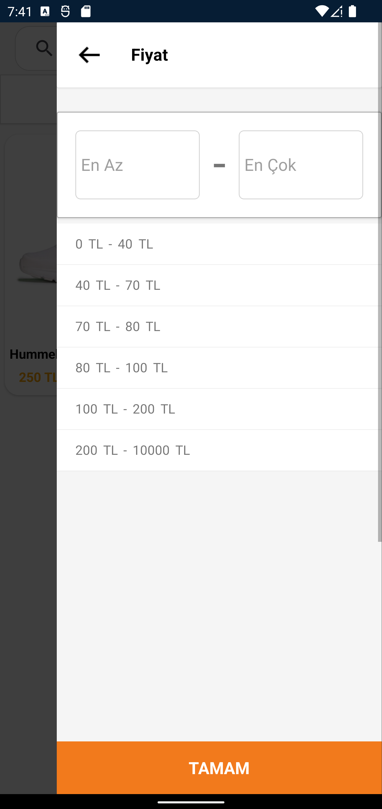

# TrendyolApp Clone

- This project is a clone of the TrendyolApp. It is a simple e-commerce mobile app that allows users to browse products, add them to their cart, and purchase them

----------

## Tech Stack

**Client:** *SqlLite,Xamarin*

**Server:** *Graphql,C#,Asp.Net Core,Entity Framework,Sql Server,Graphql,Firebase*

----------

## Features

- **Login, Register(Firebase)**
- **Cart Operations(SqlLite)**
- **Product List Operations(Graphql)**

----------

## Screenshots

<div>





</div>

----------

## Run Locally

- **Clone the project**

```bash
  git clone https://github.com/ourcelik/TrendyolApp.git
```

- **Go to the project directory**

```bash
  cd TrendyolApp
```

- **If you are using visual studio, open the solution file then chose multiple startup projects and set TrendyolAppGraphQLBackend and TrendyolApp.Android as startup projects. Then run the project.**

----------

## Contributors

- [@ourcelik](https://www.github.com/ourcelik)
- [@emreasik](https://www.github.com/emreasik)
- [@sefazorr](https://www.github.com/sefazorr)
